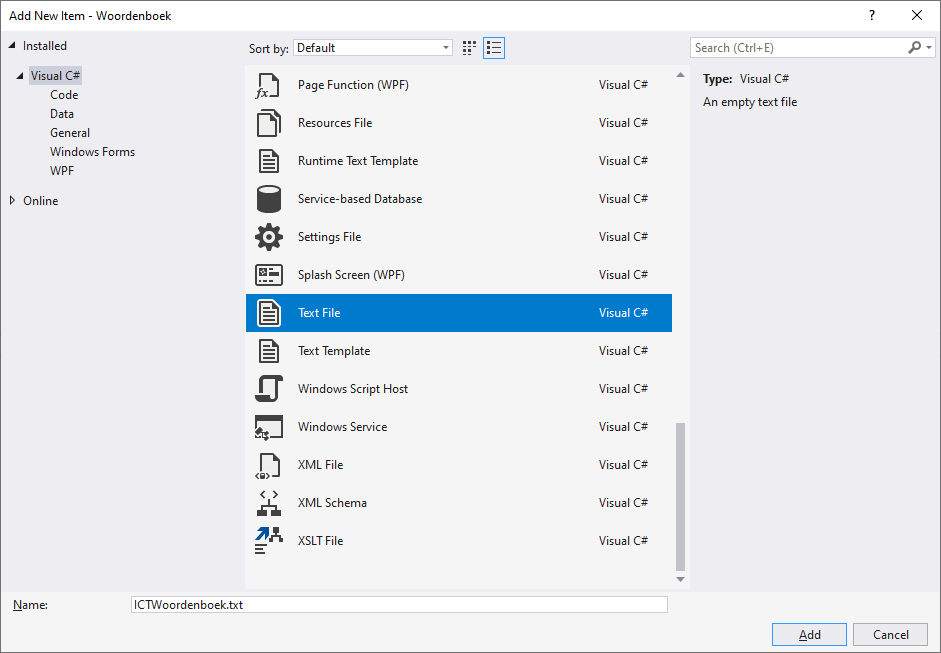
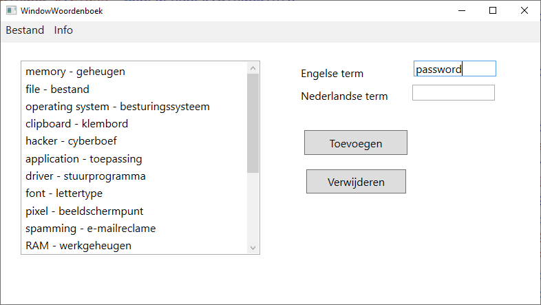
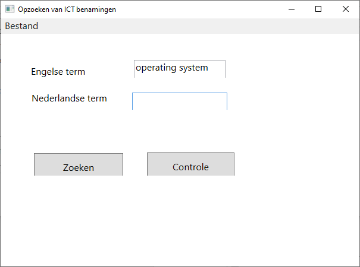
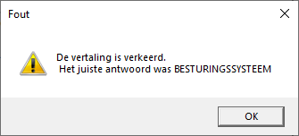
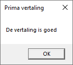
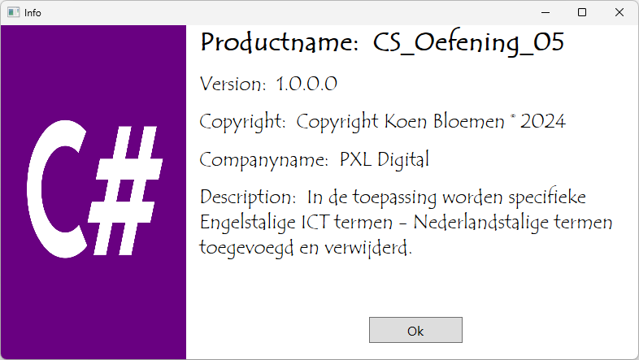

# Woordenboek

Schrijf een toepassing om de Nederlandse vertaling van Engelse specifieke technische ICT-benamingen op te slaan en op te zoeken en eventueel zelf te vertalen. De vertaling wordt in een tekstbestand bijgehouden. Voeg eventueel zelf een tekstfile toe in je toepassing. Het uitlezen van de tekstfile gebeurd wanneer het mainwindow opent.

De toepassing omvat 3 vensters en een statische klasse.

**1 Klasse Wachtwoorden.cs**

De statische klasse omvat 2 publieke List\<\> waar respectievelijk de Nederlandstalige termen en de Engelstalige termen in worden bijgehouden. Je kan ook kiezen voor een dictionary.

**2 WindowsWoordenboek**

Met de opdrachtknop *Toevoegen* kan je een specifieke benaming in het Engels en de corresponderend Nederlandstalige term toevoegen. De lijst van toegevoegde woorden worden links in een listbox toegevoegd (ook aan je List\<\>).
Met de opdrachtknop *Verwijderen* worden de termen uit de Listbox en de List\<\> verwijderd.
Het menu bestaat uit *Bestand:* *Zoeken* - *Sluiten* en *Info.*

**3 WindowsZoeken**

De opdrachtknop *Zoeken* geeft random een Engelse benaming. Geef de vertaling in het tekstvak *TxtNederlands* en met de opdrachtknop *Controle* wordt gecontroleerd of de Nederlandse vertaling correct is.

**4 WindowsOver**

Gebruik de informatie uit je bestand AssemblyInfo.cs (zie Project Properties) om je infovenster te voorzien van:
-   Productname
-   Version
-   Copyright
-   Companyname
-   Description

